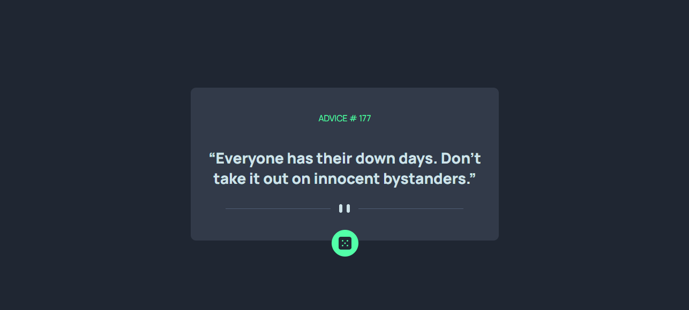

# Frontend Mentor - Advice generator app solution

This is a solution to the [Advice generator app challenge on Frontend Mentor](https://www.frontendmentor.io/challenges/advice-generator-app-QdUG-13db). Frontend Mentor challenges help you improve your coding skills by building realistic projects.

## Table of contents

- [Frontend Mentor - Advice generator app solution](#frontend-mentor---advice-generator-app-solution)
  - [Table of contents](#table-of-contents)
  - [Overview](#overview)
    - [The challenge](#the-challenge)
    - [Screenshot](#screenshot)
    - [Links](#links)
  - [My process](#my-process)
    - [Built with](#built-with)
    - [What I learned](#what-i-learned)
    - [Continued development](#continued-development)
    - [Useful resources](#useful-resources)
  - [Author](#author)

## Overview
A web app that pulls a random advice from [Advice Slip API](https://api.adviceslip.com) when you click the button, built with vanilla JavaScript, HTML, and CSS.

### The challenge
I don't get many chances to work with API calls, and this was a good refresher on how to do it.

### Screenshot

### Links

- Solution URL: [Add solution URL here](https://your-solution-url.com)
- Live Site URL: [Add live site URL here](https://your-live-site-url.com)

## My process
I first add the API calls function in a separate .js file since it is the essential part of the challenge. After making the functions work, I start adjusting the style.

### Built with
- Semantic HTML5 markup
- CSS custom properties
- Flexbox
- Mobile-first workflow

### What I learned

1. Check typos if `getElementById` or `querySelect` returns "null"
2. It was a good refresher on how to call an API, and how parsing JSON to JavaScript object works 

### Continued development
Currently, I hard coded in a wait time (about 1.5 seconds) between button click, because the API may not respond with a new advice. I am looking to solve this in the future.

### Useful resources

- [Promise](https://developer.mozilla.org/en-US/docs/Web/JavaScript/Reference/Global_Objects/Promise) - how promise is resolved
- [fetch()](https://developer.mozilla.org/en-US/docs/Web/API/fetch) - MDN web docs on how `fetch()` works

## Author

- Website - [Yingyi Mo](https://yingyimo.dev)
- Frontend Mentor - [@yingmo55](https://www.frontendmentor.io/profile/yingmo55)
